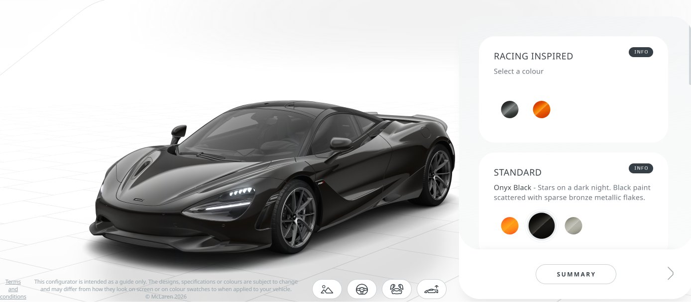

# Furki Weselne — Strategia i plan strony (dokument roboczy)

> **Status:** v1.1 — kompletna strategia + wireframes wszystkich stron + plan implementacji, gotowy do startu kodu
> **Cel dokumentu:** Wspólne dopracowanie strategii lejka sprzedażowego dla strony wynajmu samochodów na wesela.
> **Data:** 2026-05-24 (v1.1: 2026-06-26 — nowy navbar + CTA→/start, przebudowa homepage v0.5, referencja konfiguratora)

---

## 0. TL;DR — co zmieniam w Twojej wstępnej koncepcji

| Twoje założenie | Werdykt | Co robimy zamiast |
|---|---|---|
| "Stronę w stylu dobrego VSL" | ⚠️ Połowicznie | Bierzemy **psychologię i strukturę VSL** (hook → problem → agitate → solution → proof → CTA), ale **NIE format video-talking-head**. To nie info-produkt — to usługa z warm traffic. Long-form VSL dla usług konwertuje 1–4% (słabo). |
| "Samochód głównie faceci rezerwują" | ❌ Mit (częściowo) | Dane: panna młoda robi 54% planowania ślubu, 57% kobiet aktywnie szuka vendorów online, 60% planuje na mobile. **Samochód to jedna z nielicznych decyzji gdzie facet ma input** — ale RESEARCH i shortlistowanie często robi ona. Projektujemy dla **DWÓCH person równolegle**. |
| "3 proste kroki" jako motyw przewodni | ⚠️ Generyczne | Zostaje IDEA prostoty, ale hook musi być branżowy. Generyczna fraza nie różnicuje — używa jej każdy od pizzy po ubezpieczenia. |
| Konfigurator jako serce strony | ✅ Mocne | Konfiguratory +40% konwersji, Audi po wdrożeniu 3D zanotowało +66% engagementu. Ale **konfigurujemy USŁUGĘ** (data, trasa, dekoracja, dodatki), bo sam samochód jest gotowy. |

---

## 1. Persony — kto naprawdę kupuje (oparte na danych, nie intuicji)

### Dane wejściowe
- Panna młoda robi ~54% planowania, pan młody ~25% (reszta: rodzina, planner)
- **81% kobiet mówi, że partner spędził "zero, prawie nic lub wyraźnie mniej" czasu planując ślub**
- 60% panien młodych planuje głównie z telefonu, 80% par całkowicie cyfrowo
- 57% kobiet aktywnie szuka vendorów online (vs. 22% w 2011)
- ALE: w badaniach branżowych **samochód** wskazywany jest jako jedna z nielicznych decyzji, gdzie pan młody ma realny, chętny udział

### Wniosek: dwie persony, dwie ścieżki
Nie projektujemy "dla faceta". Projektujemy dwa równoległe doświadczenia w jednej stronie:

#### Persona A — "Ania, researcherka" (panna młoda, 26–32, pierwszy odwiedzający, mobile)
- **Co robi:** Shortlistuje 3–5 wypożyczalni w pierwszych 2 tygodniach planowania (zwykle 8–12 mies. przed ślubem)
- **Czego szuka:** Estetyka, "vibe" dopasowany do reszty wesela, zdjęcia z REALNYCH wesel (nie stock), opinie, czy "fajni są ci ludzie"
- **Pain points:** Strach, że auto będzie tandetne / nie pasujące, że obsługa rozczaruje, że "wyjdzie drożej niż zapowiadali"
- **Co konwertuje:** galeria z prawdziwych wesel, recenzje z imionami i datami, transparentna cena, możliwość wysłania linku do męża/mamy
- **Device:** mobile, scrolluje wieczorem (statystycznie peak 21:00–23:00)

#### Persona B — "Marek, decyzyjny" (pan młody, 28–35, drugi odwiedzający, mix mobile/desktop)
- **Co robi:** Dostaje link od narzeczonej z 1–3 opcjami, ma "powiedzieć tak lub nie", często też płaci
- **Czego szuka:** Konkret. Cena. Dostępność. "Czy mogę to ogarnąć w 5 minut?"
- **Pain points:** Niechęć do długich formularzy, brak czasu, podejrzliwość wobec ukrytych kosztów, wstyd "jeśli się pomyli z autem"
- **Co konwertuje:** Sticky pasek z ceną, kalendarz dostępności na czole, jeden CTA, brutalna transparentność (co JEST w cenie, co NIE jest)
- **Device:** często desktop w pracy + finalna decyzja na mobile

### Strategiczna konsekwencja
- **Powyżej fold:** wizualnie wabik dla Ani (hero shot auta w realnym kontekście weselnym) + natychmiastowy konkret dla Marka (sticky CTA "Sprawdź dostępność na swoją datę")
- **Konfigurator** musi być na tyle "ładny i klikalny" by Ania chciała się nim bawić, i na tyle szybki by Marek dotarł do ceny w <60 sekund
- **Share button na każdej karcie auta** ("Udostępnij") — to nie gimmick, to obsługa realnej dynamiki decyzyjnej

---

## 2. Tło rynkowe (Polska)

### Rozmiar i kontekst
- Średnie wesele 2025: 80–100k zł, na 100 osób: 50–70k zł
- Koszt sali + jedzenie: ~50% budżetu
- Samochód = drobny, ale **emocjonalnie ważny** ticket (~1–5k zł zwykle, premium 5–15k+)
- Najczęstszy moment rezerwacji: 6–10 miesięcy przed ślubem (long sales cycle!)

### Konkurencja PL (do późniejszej analizy)
- **SpectrumCars** — ~40 sportowych/luksusowych
- **SexyCars** — sport, łatwa rezerwacja online
- **Cylindersi** — klasyki
- **samochody-weselne.pl** — agregator
- **gdziewesele.pl / planujemywesele.pl** — agregatory z 2000+ opinii

> **TODO:** Po doprecyzowaniu naszego segmentu zrobimy szczegółowy teardown 2–3 największych konkurentów (UX, copy, ceny, CTA).

---

## 3. Struktura lejka — wstępna propozycja (do iteracji)

### Architektura (4 strony, nie 3)
```
[ Reklamy / Google / Instagram / polecenia ]
            │
            ▼
   ┌────────────────────┐
   │  1. STRONA GŁÓWNA  │  ← Hook + visual proof + CTA do konfiguratora
   └─────────┬──────────┘
             │
             ▼
   ┌────────────────────┐
   │  2. KONFIGURATOR   │  ← "Wybierz furę" — interaktywny browse
   └─────────┬──────────┘
             │
             ▼
   ┌────────────────────┐
   │  3. KARTA AUTA     │  ← Deep dive + cena + dostępność + rezerwacja
   └─────────┬──────────┘
             │
             ▼
   ┌────────────────────┐
   │  4. POTWIERDZENIE  │  ← Anti-buyer's-remorse + upsell + share
   └────────────────────┘

   + strony pomocnicze: O nas, FAQ, Galeria z wesel, Kontakt
```

**Dlaczego 4 a nie 3:** Twoje "3 kroki" odnoszą się do USER FLOW wewnątrz konfiguratora, a nie do liczby stron. To dwa różne poziomy abstrakcji.

---

## 4. Strona 1 — Główna (hook + zaufanie + push do konfiguratora)

### Hook above-fold — odrzucone i wybrane warianty

| Hook | Problem | Werdykt |
|---|---|---|
| "Zarezerwuj samochód w 3 prostych krokach" | Generyczne, używa tego każdy. Nie buduje pragnienia. | ❌ |
| "Wymarzone auto na Twoje wesele" | Słabe, suche, brak konkretu | ❌ |
| "Sprawdź czy Twoje wymarzone auto jest wolne 14.06" | Konkret, hook na pilność, dynamiczna data | ✅ kandydat |
| "Wybierz furę. Wpisz datę. My ogarniamy resztę." | Trzy krótkie zdania = "3 kroki" bez wypowiadania tego frazesu. Token "furę" = język grupy docelowej | ✅ kandydat (mocny) |
| "Twoje wesele zasługuje na lepszy samochód niż BMW wujka" | Pozycjonowanie przez kontrast, humor, polski insight | ✅ ryzykowny ale potencjalnie viralowy |

> **Do decyzji z Tobą:** który ton — premium/elegancki, swój/męski, czy humorystyczny?

WYBIERAM COŚ W STYLU ruchome hero z kilkoma widokami różnych naszych weselnych samochodów zmieniające się co np. 5 sekund i napis "Twój [marka samochodu aktualnie pokazanego na zdjęciu] Idealny na Wesele" czy jakieś podobne formy tego formatu.

### Globalny nagłówek (header / navbar) — obowiązuje na KAŻDEJ stronie

Sticky top bar, identyczny wszędzie. Elementy (od lewej):

1. **Logo — wyraźnie klikalne, prowadzi zawsze na stronę główną (`/`)**. Kursor `pointer`, hover state, `aria-label="Furki Weselne — strona główna"`. To podstawowy element nawigacji powrotnej.
2. **O nas** → `/o-nas`
3. **Flota** → `/flota`
4. **Gotowe pakiety** → `/pakiety`
5. **Konfigurator** → `/konfigurator`
6. **Kontakt** → `/kontakt`
7. **CTA — kontrastujący przycisk** (jedyny wypełniony/akcentowy element w navie), np. **„Zarezerwuj"** → prowadzi do **dedykowanej strony wyboru ścieżki `/start`** (patrz niżej), a NIE bezpośrednio do pakietów/konfiguratora.

> **Mobile:** logo + hamburger (☰). CTA „Zarezerwuj" zostaje widoczny obok hamburgera (nie chowamy głównej konwersji w menu).

### Dedykowana strona CTA — `/start` (rozwidlenie ścieżek)

Każde główne CTA z navbara i z sekcji strony głównej (poza wyjątkiem hero — patrz niżej) prowadzi do **jednej, spójnej strony `/start`**, która powtarza decyzję z homepage:

- **Lewa karta: 🎁 Gotowe pakiety** → `/pakiety`
- **Prawa karta: 🎮 Złóż swój pakiet (konfigurator)** → `/konfigurator`

Stąd użytkownik trafia „adekwatnie do konkretnej podstrony". Dzięki temu komunikat CTA jest **jeden, powtarzalny i przewidywalny** w całym serwisie — użytkownik zawsze wie, co się stanie po kliknięciu.

> **Wyjątek (skrót):** jeśli ktoś już w **hero** wybierze datę i kliknie „Dalej", omijamy `/start` i przechodzimy **bezpośrednio do 2. etapu konfiguratora** z autem z hero zaznaczonym domyślnie. Aktywna intencja = mniej kliknięć. Drugi wyjątek to jak ktoś na stronie główej kliknie na kafelek z pakietami to idzie od razu do palietów i jak kliknie konfigurator to od razu do konfiguratora

### Struktura strony głównej (mobile-first) — v0.5
0. Często powtarzany przycisk CTA prawie że po każdej sekcji aby minimalizować tarcie.
1. **Hero (animowany)** — pełnoekranowe, **zmieniające się tło z autami floty** sfotografowanymi w jednolity sposób (ten sam kadr/światło/tło studyjne, patrz referencja konfiguratora w 9d). Po **lewej** headline ze **zmieniającą się nazwą auta**: *„[Bentley Continental GT] na Twoje Wesele"* (nazwa zmienia się w rytm tła). Po **prawej** tabliczka/panel: **wybór daty + przycisk „Dalej →"**. Klik „Dalej" → **2. etap konfiguratora** z autem, które było aktualnie w hero, **zaznaczonym domyślnie** (zmienialnym na tym etapie).
2. **Opinie par** — poziomy pasek krótkich cytatów (małe teksty, imię + auto + data), przewijalny. Lekki social proof bez ciężkiej sekcji.
3. **Dwie ścieżki** — 🎁 Gotowe pakiety **albo** 🎮 Samodzielny konfigurator (te same dwie karty co na `/start`).
4. **Nasze obietnice** — 6 micro-gwarancji w ramie **problem → rozwiązanie**: *„Nie martw się, że [problem]"* → nasza odpowiedź (np. *„Nie martw się, że auto spóźni się na ceremonię — punktualność albo zwrot godziny"*). Budujemy poczucie problemu i od razu go rozbrajamy.
5. **Piękne modele + ponowne rozwidlenie** — sekcja pokazująca, że mamy wyjątkową flotę (kilka hero-shotów modeli, BEZ pełnego gridu floty), zakończona spójnym przekazem: *„Weź sprawdzony, gotowy pakiet — albo bądź super klientem i spersonalizuj wszystko pod siebie"* → znów dwie ścieżki / CTA `/start`.
6. **FAQ** — top obiekcji (akordeon).
7. **Kontakt** — telefon klikalny, WhatsApp, e-mail, godziny pracy.

> **USUNIĘTE z homepage:** osobna sekcja „Nasza flota" (grid 6–9 aut) — pełna flota żyje na `/flota`. Na homepage zostają tylko hero + reprezentatywne modele w sekcji 5.

> **Powtarzalne CTA:** to samo CTA co w navbarze („Zarezerwuj" → `/start`) wraca regularnie między sekcjami. Wyjątek: hero, gdzie aktywny wybór daty prowadzi bezpośrednio do konfiguratora.

### Dlaczego TAKA struktura
Hero z animowanym tłem + zmienną nazwą auta = wizualny wabik dla Ani i natychmiastowa akcja (data → „Dalej") dla Marka, bez zmuszania do wyboru auta z góry. **Jedno, powtarzalne CTA** w całym serwisie eliminuje decyzyjny paraliż — użytkownik zawsze wie, dokąd trafi.

---

## 5. Strona 2 — Konfigurator (serce lejka)

### Co konfigurujemy (kluczowa decyzja!)
**NIE** konfigurujemy samochodu (jest gotowy). Konfigurujemy **PAKIET USŁUGI**:
1. **Data + godziny** (najpierw — bo eliminuje 30% ofert)
2. **Liczba aut** (jedno dla pary młodej / kolumna dla rodziny)
3. **Trasa** (z kąd, na gdzie, ile km — wpływa na cenę)
4. **Auto** (galeria z filtrami: typ — klasyk/sport/luksus/SUV/cabrio; kolor; liczba miejsc)
5. **Dodatki** (kierowca tak/nie, dekoracja, szampan, kwiaty, czerwony dywan)

### UX zasady (z badań)
- **Real-time pricing** — cena aktualizuje się przy każdym kliknięciu (kluczowe dla zaufania)
- **3D / wysokiej jakości zdjęcia** z wielu kątów — Audi po wdrożeniu 3D miał +66% engagementu
- **Smart defaults** — większość ludzi nie chce klikać 20 opcji. Domyślnie wybieramy "standardowy pakiet" i pozwalamy modyfikować
- **Mobile-first** — sliders > dropdowns, single column, kciukiem
- **Save & share** — możliwość wysłania konfiguracji mężowi/żonie linkiem
- **Postęp wizualny** — pasek "Krok 2 z 4" — TUTAJ wraca obietnica "3 proste kroki" (lub 4)

### Anty-pattern do uniknięcia
❌ Konfigurator typu "Mercedes" gdzie masz 40 opcji i się gubisz. Auto Audi miał 17 ekranów w starym konfiguratorze — wszyscy odpadali.
✅ Maks 4 kroki, każdy z 3–6 wyborami, smart defaults.

---

## 6. Strona 3 — Karta auta (deep dive + close)

### Cel: sprzedać KONKRETNĄ furę i domknąć rezerwację

### Sekcje (od góry)
1. **Galeria** (10+ zdjęć, w tym min. 3 z realnych wesel)
2. **Hero info bar** — nazwa, rocznik, kolor, cena OD, **DOSTĘPNOŚĆ na wybranej dacie** (zielone/czerwone)
3. **Wideo 30–60 sek** — to JEST nasz "VSL", ale w stylu lookbook/teaser, nie talking head
4. **Specyfikacja w punktach** — co lubi Marek
5. **"W komplecie dostajesz"** — bullet list z ✅
6. **Cennik dodatków** — transparentnie
7. **Social proof tej KONKRETNEJ fury** — "Tym autem jeździło 18 par" + ich zdjęcia
8. **CTA blok** — sticky bottom bar mobile: "Zarezerwuj 14.06 — 2,800 zł" → checkout
9. **FAQ specyficzne**

### Kluczowe: anty-objekcje wbudowane w stronę
- "Co jeśli mój termin się zmieni?" → tu odpowiedź
- "Czy auto jest sprawne / kiedy ostatni przegląd?" → dane
- "Co jeśli auto ulegnie awarii przed ślubemin?" → polityka

---

## 7. Strona 4 — Potwierdzenie rezerwacji

### Często pomijana — a tu się dzieje magia retention/upsell

1. **Wielki ✅ + reset układu nerwowego** ("Wszystko ogarnięte. Już nic nie musisz robić.")
2. **Co się stanie dalej** (timeline w 3 punktach: 1. dziś dostaniesz mail, 2. tydzień przed weselem zadzwonimy, 3. w dzień ślubu kierowca będzie 30 min przed)
3. **Numer telefonu do KONKRETNEJ osoby** (zmniejsza buyer's remorse)
4. **Upsell delikatny** — "Dodaj drugą furę dla rodziców rabatem 15%"
5. **Share** — "Wyślij swojej drugiej połowie szczegóły"
6. **Prośba o follow Instagrama** (długoterminowy nurturing dla polecenia)

---

## 8. Co BIERZEMY z VSL (psychologia, nie format)

VSL = Video Sales Letter, ale na naszej stronie to **przekładamy na sekwencję narracyjną tekstu + obrazu + interakcji**:

| Element VSL | Jak przekładamy |
|---|---|
| **Hook (pierwsze 7 sek)** | Hero + headline + sticky date picker |
| **Pattern interrupt** | Niebanalne zdjęcie / wideo / fraza ("furę" zamiast "samochód") |
| **Problem agitation** | Sekcja "Co może pójść nie tak" → "u nas: nie pójdzie, oto dlaczego" |
| **Solution reveal** | Konfigurator jako "magia rozwiązująca problem" |
| **Proof stack** | Galeria z wesel + opinie + liczby + media (jeśli mamy) |
| **Objection handling** | FAQ + sekcje "co dostajesz" + transparentne ceny |
| **Urgency / Scarcity** | **REALNA** dostępność w kalendarzu ("Pozostały 2 wolne soboty w czerwcu") — nie fake countdown |
| **Strong CTA** | Sticky bottom CTA na każdej stronie, max 1 główne CTA na sekcję |

### Czego NIE robimy z VSL
- ❌ Długi monolog wideo (działa dla info-produktów, NIE dla usług)
- ❌ "Pisz BUY w komentarzach" / agresywne urgency
- ❌ Sprzedaż przez emocjonalny szantaż ("nie zniszcz dnia ślubu byle czym")
- ❌ Fake countdown timery — w branży weselnej szybko stracimy zaufanie

---

## 9. Dane i statystyki, które prowadzą nasze decyzje

| Statystyka | Źródło/branża | Implikacja dla naszej strony |
|---|---|---|
| Konfigurator +40% konwersji | Vagon (badania automotive) | Konfigurator jest nie-do-pominięcia |
| Audi 3D = +66% engagementu | Audi case study 2018 | Inwestujemy w wysokiej jakości wizualizację |
| VSL dla usług: 1–4% konwersji | Branża VSL | Nie liczymy że samo wideo zbawi konwersję |
| Video na LP = +80% konwersji | EyeView | Krótkie wideo w hero TAK; long-form VSL NIE |
| 93% konsumentów: opinie wpływają na zakup | Genesys | Opinie nie są "nice to have" — są fundamentem |
| 92% waha się gdy brak opinii | Genesys | Min. 20 opinii widocznych na stronie głównej |
| Video testimoniale +80% konwersji | Genesys | Inwestujemy w 3–5 wideo opinii (telefon wystarczy) |
| UGC +29% konwersji | Genesys | Galeria z wesel jako sekcja, nie podstrona |
| 60% panien planuje na mobile | Wedding industry 2025 | Mobile-first nie jest opcją |
| 80% par planuje cyfrowo | Wedding industry 2025 | Cały lejek musi działać bez telefonu (ale telefon jako fallback) |
| Real-time social proof +10–15% konwersji | Provesrc | "Anna z Krakowa właśnie zarezerwowała Mustanga na 12.07" (tylko jeśli prawdziwe!) |

---

## 9b. Decyzje strategiczne — v0.2 (Twoje odpowiedzi + moja krytyka)

### Co już wiemy
| Wymiar | Decyzja | Konsekwencja |
|---|---|---|
| **Zasięg** | Jedno miasto + okolice | Lokalne SEO, ułatwiona logistyka. **MIASTO WARSZAWA I SZEROKO POJĘTE OKOLICE** |
| **Segment** | START: Mercedes S, BMW serii 4, Maserati. DOCEL: 911, Bentley, ew. Rolls-Royce, Lambo, Ferrari | **PREMIUM/LUKSUS**, nie sport stricte. To zmienia ton — odpada slang "fura" w S-klasie. |
| **Persony** | Strona ma działać dla pary: prostota dla Ani + zabawa 3D-konfiguratorem dla Marka | Spójne z naszym planem dual-persona. |
| **USP** | Świeże, nowoczesne UX. Przyjemność spędzania czasu. SEO. Łatwo rosnąca flota. | **SEO i flota = USP biznesowe, nie do copy.** Wyróżnik na stronie = **UX/design**. |

### KRYTYCZNE UWAGI v0.2

**1. Slang "fura" odpada dla tego segmentu**

Para szukająca Bentleya za 8k/dzień NIE mówi "fura". Mówi "wyjątkowy samochód", "luksusowy", "klasa". Slang męski/swojski działa dla SexyCars (Mustang 2k) — nie dla Twojego segmentu.

> **Wniosek:** Ton = **nowoczesny premium z ciepłem**. Apple × Tesla × Airbnb. Krótkie zdania, dużo whitespace, fotografia premium. Nie sztywno, ale nie "luzacko". Profesjonalnie ludzko.

Trzy proponowane warianty tonu (przykładowe headline'y):

#### Wariant A — "Cichy luksus" (Apple-like)
- Hook: *"Twój samochód na wesele. Wybrany w 60 sekund."*
- Sekcja: *"S-klasa. Bentley. 911. Sprawdź, co jest wolne na Twoją datę."*
- DNA: minimalizm, krótkie zdania, fotografia, brak emoji, brak wykrzykników
- Plus: czytelne premium, działa dla obu person
- Minus: ryzyko bycia "zimnym" jeśli kreacja nie jest top-notch

#### Wariant B — "Lekko mrugnięcie okiem"
- Hook: *"Na wesele zasługujecie na coś lepszego niż BMW kuzyna."*
- Sekcja: *"Wybierz samochód, którym chce się jeździć. Nie tylko pozować."*
- DNA: premium ale z polskim insightem i humorem, jeden żart na sekcję, reszta serio
- Plus: zapadające w pamięć, viralowe, różnicuje od konkurencji
- Minus: ryzykowne dla najbardziej premium klienta (Bentley)

#### Wariant C — "Konfigurator-first" (Porsche-like)
- Hook: *"Skonfiguruj samochód na swój ślub."*
- Sekcja: *"Wybierz markę. Wybierz pakiet. Zarezerwuj."*
- DNA: produktowy, jak strony producentów aut, konfigurator jako gwiazda
- Plus: spójne z USP (świeży UX), pokazuje od pierwszej sekundy że tu jest INACZEJ
- Minus: mniej emocjonalne, mniej "weselne"

**Moja rekomendacja:** **Wariant A jako bazowy + 1 element z C (mocna prezencja konfiguratora) + 1 mrugnięcie z B w sekcji "O nas" lub FAQ.** Bezpieczne dla Bentleya, atrakcyjne dla 911-żartownisia.

---

**2. Problem nowego biznesu bez referencji (CZERWONA FLAGA)**

Dane: 92% klientów waha się gdy brak opinii. W branży weselnej to JESZCZE silniejsze — ślub to event "raz w życiu", ryzyko = ekstremalne.

#### Strategia "pre-launch" — bez tego stronę zabije brak proof
| Krok | Co robimy | Po co |
|---|---|---|
| 1 | 3–5 pierwszych wesel po kosztach / 50% rabatu | W zamian: pełna sesja foto + video + opinia + zgoda na publikację |
| 2 | Sesja stylizowana z modelami w plenerze | "Wedding shoot" bez prawdziwej pary — daje materiał wizualny od day 1 |
| 3 | Wideo "behind the scenes" — kim jesteście, gdzie garaż, jak wygląda przygotowanie auta | Buduje zaufanie przez transparentność, nie liczby |
| 4 | Sekcja "Nasza flota — sprawdzona i ubezpieczona" zamiast "247 wesel za nami" | Inny vector zaufania |
| 5 | Pisemna gwarancja "Money-back jeśli auto się nie pojawi" + ubezpieczenie OC | Eliminuje główny strach |
| 6 | Pokazać siebie / zespół / telefon do KONKRETNEJ osoby | Personal trust > company trust |

> **To MUSI być w strategii od day 1.** Bez tego stronę odwiedzą i zaraz wyjdą do konkurencji z 200 opiniami.

---

**3. SEO ≠ USP komunikacyjne**

SEO to **kanał pozyskiwania ruchu**, nie wyróżnik dla klienta. Klient na stronie nie zobaczy "jesteśmy SEO-friendly". To dwie różne rzeczy:

| | SEO (biznes) | USP (klient) |
|---|---|---|
| **Co to** | Strategia pozyskiwania ruchu | Powód dla którego klient wybierze CIEBIE |
| **Twój plan** | Świetny: long-tail "Mercedes S klasa wesele [miasto]" | Świetny: nowoczesna, przyjemna strona, świeże podejście |
| **Gdzie żyje** | Backend, meta tagi, struktura URL, blog | Frontend: copy, design, doświadczenie |

**Wniosek:** Plan SEO zrobimy osobno w sekcji technicznej (10–14). USP na stronie = **"Tu się dobrze spędza czas, tu jest po ludzku"**.

---

**4. Konkretna strategia SEO (skoro to Twój pomysł na traffic)**

Najlepsze frazy do zdobycia dla segmentu premium + jedno miasto:

| Typ frazy | Przykład | Konkurencja | Intent |
|---|---|---|---|
| **Brand + miasto** | "wynajem mercedes s klasa wesele [miasto]" | Niska | Bardzo wysoki — gotowy kupić |
| **Model + okazja** | "bentley do ślubu [miasto] cena" | Bardzo niska | Bardzo wysoki |
| **Generyczne lokalne** | "auto na wesele [miasto]" | Wysoka | Średni |
| **Long-tail problem** | "ile kosztuje wynajem mercedesa na ślub" | Niska | Średni-wysoki |
| **Komparatywne** | "porsche czy mercedes na wesele" | Bardzo niska | Niski-średni (research) |

**Strategia:** Strona główna pod generyczną lokalną. **Osobne podstrony dla każdej marki/modelu** ("Mercedes S klasa na wesele [miasto]") — tu wygrywamy long-tail. Plus **blog/poradnik** z 8–12 artykułami pod research queries.

---

## 9c. Teardown konkurencji — Warszawa, premium (v0.3)

### Konkurenci do pobicia (wybrani na podstawie SERP "wynajem mercedes s klasa wesele Warszawa")
1. **SpectrumCars** — silne brand, ~40 aut, oddziały w miastach
2. **SexyCars** — szeroka flota sportowych, mocne SEO
3. **VipCars Warsaw** — premium, Mercedes S w full opcji
4. **BlackCars / L'Escape** — premium z kierowcą, profesjonalne
5. **Limuzynada do Ślubu / samochody-weselne.pl** — agregat, niska cena
6. **GlobalEliteCar** — luksus

### Twoje pozycjonowanie cenowe na rynku Warszawa (Mercedes S na ślub)
- **Limuzynada do Ślubu**: 700–900 zł / 4.5h (bardzo tanio)
- **Biały Mercedes**: 250 zł/h (ok. 1100 zł / 4.5h)
- **Średnia rynkowa**: 800–1500 zł
- **Premium (L'Escape, VipCars)**: 1500–2500+ zł
- **Twoja flota docelowa (Bentley/911)**: 3000–8000+ zł — segment z mniejszą konkurencją

### 🔥 6 LUK konkurencji = 6 Twoich przewag

| # | Czego NIKT nie ma (lub robi źle) | Co my robimy |
|---|---|---|
| **1** | **Brak prawdziwego systemu rezerwacji online.** Wszyscy wypychają na WhatsApp/telefon/formularz "zapytaj o ofertę". Spectrum: WhatsApp na każdym CTA. SexyCars: tylko formularz kontaktowy. | **Pełny konfigurator z real-time dostępnością i ceną.** Klient widzi cenę, klika "Rezerwuj", dostaje potwierdzenie. To jest **gigantyczna luka** — wygrywamy od pierwszej sekundy. |
| **2** | **Fake / brak social proof.** Spectrum ma sekcję "Zaufanie" BEZ JEDNEJ OPINII. SexyCars: "5/5 (4582 votes)" bez treści. Nikt nie pokazuje zdjęć z realnych wesel z imionami. | **10+ prawdziwych opinii z imionami + zdjęcia z REALNYCH wesel + opinie Google bezpośrednio embedded.** Jeśli masz "trochę opinii" — pokażemy je agresywnie. |
| **3** | **Staromodny katalogowy design.** Wszyscy mają strony jak z 2010 — siatki aut, mnóstwo tekstu, niskiej jakości zdjęcia. | **Apple/Tesla-level UX.** Dużo whitespace, fotografia premium, 3D/360°, animacje, mobile-first. **To jest CORE Twojego USP.** |
| **4** | **Brak transparentnego cennika.** "Od X zł" + drobnym drukiem "skontaktuj się". Spectrum: ceny tylko pakietów 2-dniowych. | **Pełna transparentność: cena podstawowa + każdy dodatek w cenniku + co JEST w cenie + co NIE jest. Bez gwiazdek.** |
| **5** | **Brak "co dostajesz w cenie".** Klient musi zgadywać czy kierowca, dekoracja, paliwo, ubezpieczenie. | **Bullet list z ✅ "W cenie:" i ❌ "Dodatkowo płatne:".** Brutalna jasność. |
| **6** | **Hooki generyczne.** "Twój dzień powinien być niezapomniany", "Auta do ślubu". Zero różnicowania. | **Konkretny, brand-owy hook** (decyzja w sekcji 9b — wariant A+C+B). |

### Bonus: dodatkowe luki które zauważyłem

- **Brak gwarancji** ("co jeśli auto się nie pojawi") — ślub to event raz w życiu, ten strach jest realny. My damy pisemną gwarancję + backup car policy.
- **Brak mobile-first** — większość konkurentów ma desktop-first, mobile to przemyłczany dodatek. 60% panien planuje na telefonie.
- **Brak "share to partner"** — żaden konkurent nie ma jednoklikowego "wyślij konfigurację partnerowi". A to jest CORE dynamic dla persony Ani→Marek.
- **Brak inline FAQ** w sekcjach — wszyscy mają FAQ na dole jako akordeon. Lepiej rozsiać micro-FAQ przy każdej obiekcji.

### FINALNE USP — pozycjonowanie

> **"Wynajem aut luksusowych na wesele w Warszawie z konfiguratorem, który działa jak Apple — prosty, szybki, pokazuje cenę od razu. Bez wymiany 15 maili. Bez 'zapytaj o ofertę'. Wybierz, sprawdź dostępność, zarezerwuj."**

**Trzy filary:**
1. **PROCES** — najprzyjemniejszy konfigurator w branży (różnicowanie UX)
2. **TRANSPARENTNOŚĆ** — cena widać od razu, wszystko jasne (różnicowanie zaufania)
3. **FLOTA** — wybór luksusu od Mercedesa S po Bentleya (różnicowanie produktu)

---

## 9d. Konfigurator jako "Playground" — wizja v0.3

### 🎯 Referencja wizualna konfiguratora (wzór do naśladowania)



> **Plik:** `assets/references/konfigurator-mclaren-reference.png` — wrzuć tu wklejony zrzut ekranu (konfigurator McLaren). Patrz [assets/references/README.md](assets/references/README.md).

**Tak ma wyglądać nasz konfigurator** (zrzut: konfigurator McLaren 720S):
- **Lewa strona:** wielki render auta na jasnym, studyjnym tle z subtelną siatką podłogi — dużo whitespace, czysto, premium. (U nas: foto/360° z `<CarVisualizer>`.)
- **Prawa strona:** białe, zaokrąglone karty opcji jedna pod drugą („RACING INSPIRED", „STANDARD"…), w każdej krótki opis + klikalne swatche/wybory + plakietka „INFO". (U nas: czas wynajmu, trasa, dodatki, kierowca.)
- **Akcent kolorystyczny** (u McLarena pomarańcz) — pojedynczy kontrastowy kolor na aktywnych elementach i CTA.
- **Sticky „SUMMARY"/podsumowanie** na dole prawego panelu → u nas real-time cena + „Zarezerwuj".
- DNA: minimalizm, jeden akcent, duże zdjęcie, opcje jako karty z mikro-opisami. **Apple × Porsche × McLaren.**

### Zmiana paradygmatu
**Konfigurator NIE jest narzędziem konwersji.** Jest **engagement magnet** i **brand experience**.

Insight: faceci konfigurują samochody których nigdy nie kupią. Porsche Configurator ma miliony użyć rocznie — większość nie skończy się zakupem. **A jednak go robią.** Bo:
- Buduje pożądanie i status marki
- Dzielą się konfiguracjami (organiczny zasięg)
- Wracają wielokrotnie (powtarzalne wejścia = nurturing)
- Tworzą "imaginary ownership" — gdy kiedyś będą gotowi kupić, marka jest top-of-mind

### Implikacja dla nas
**Konfigurator musi być przyjemny dla osoby, która NIE chce dziś rezerwować.** Jeśli dla Marka klikanie naszego konfiguratora jest fajne wieczorem na kanapie z piwem (nawet jeśli wesele dopiero za 2 lata), to:
1. Wraca i poleci znajomym
2. Wyśle koleżance/żonie
3. Gdy nadejdzie czas — pamięta nas
4. SEO bonus: time on site, low bounce rate

### Decyzje flow konfiguratora — v0.3 (BATCH 1)

| Wymiar | Decyzja | Krytyka / detal |
|---|---|---|
| **Layout** | Klasyczny "manufacturer-style": panel 3D/wizualizacja po lewej + sticky panel opcji po prawej | Wzór: Porsche Configurator, Tesla Design Studio. Marek pozna ten layout. |
| **Wybór auta** | Dropdown z nazwami + jednocześnie pasek miniatur (tabsów) pod modelem 3D | Marek użyje dropdownu, Ania kliknie miniaturkę. Dual UX. |
| **Data** | Stała widoczność w **sticky top bar** (cały czas dostępna do zmiany) | Klient widzi datę zawsze, ale nie blokuje go w wyborze auta. |
| **Dostępność** | Każde auto pokazuje status na wybraną datę: 💚 wolne / 🟡 mało godzin / 🔴 zajęte na soboty / 🔴 zajęte 14.06 | **PRAWDZIWE FOMO** — nie fake countdown, tylko realna scarcity. Buduje zaufanie. |
| **Cena** | Real-time, pełna, sticky w prawym panelu, animacja przy zmianie | Aktualizacja przy każdym kliknięciu. Klient widzi WPŁYW każdej decyzji. |
| **Auto zajęte na wybraną datę** | Pozostaje klikalne, pokazuje: "Niedostępne 14.06 — najbliższy wolny termin: 28.06" + przycisk "Zmień datę na 28.06" | Frustrację zamieniamy w nową ścieżkę. Nie blokujemy fantazji. |
| **Finalizacja** | Płatność zaliczki online (20–30%) → rezerwacja natychmiastowa | Wymaga: Przelewy24/Stripe, T&C, polityka anulacji (batch 3). |
| **Save & Share** | "Zapisz konfigurację" + jednoklikowy "Wyślij swojej drugiej połowie" (mail, WhatsApp, link) | Core dla persony Ani→Marek. **Nikt z konkurentów tego nie ma.** |
| **Wizualizacja MVP** | Zdjęcia HD na start, architektura przygotowana pod 360°/3D | Foto sesja **metodą obrotową** od day 1. Komponent React z elastycznym API media. |

### ASCII wireframe — Konfigurator (DESKTOP)

```
┌──────────────────────────────────────────────────────────────────────────┐
│ [LOGO]   Data ślubu: [📅 14.06.2026 ▼]   💚 dostępne na ten dzień: 4/7  │
├──────────────────────────────────────────────────────────────────────────┤
│                                                                            │
│ Wybierz auto: [▼ Bentley Continental GT      ]    [Porównaj 3 auta]       │
│                                                                            │
│ ╔══════════════════════════════════╗ ┌─────────────────────────────────┐ │
│ ║                                   ║ │  BENTLEY CONTINENTAL GT         │ │
│ ║                                   ║ │  2023 · biały perłowy · 4 osoby │ │
│ ║      [3D MODEL 360° / FOTO]       ║ │  💚 Wolne 14.06                 │ │
│ ║                                   ║ ├─────────────────────────────────┤ │
│ ║         ↻ obróć palcem            ║ │ ⏱  CZAS WYNAJMU                 │ │
│ ║                                   ║ │ [4h] [▶6h◀] [8h] [cały dzień]   │ │
│ ╚══════════════════════════════════╝ │                                  │ │
│                                       │ 📍 TRASA                         │ │
│ ◀ [📷][📷][📷][📷][📷][📷] ▶          │ Skąd: [Wilanów        ]          │ │
│  hero  wnętrze  detal  ...            │ Dokąd: [Pałac Jabłonna ]         │ │
│                                       │ Trasa: 32 km · +0 zł              │ │
│ ───────────────────────────────────   │                                  │ │
│                                       │ 🎀 DODATKI                       │ │
│ Inne auta na 14.06:                   │ ☑ Dekoracja kwiatowa     +250 zł │ │
│ [Maserati 💚] [BMW7 🟡] [Mercedes-S 💚]│ ☑ Czerwony dywan         +100 zł │ │
│ [Porsche 🔴 niedost.] [Audi A8 💚]    │ ☐ Szampan dla pary       +150 zł │ │
│                                       │ ☐ Wstążki / "Młoda Para" +50 zł  │ │
│                                       │ ☐ Dodatkowy fotograf     +600 zł │ │
│                                       │                                  │ │
│                                       │ 👤 KIEROWCA: ✅ w cenie           │ │
│                                       ├─────────────────────────────────┤ │
│                                       │ Cena podstawowa:       3,800 zł │ │
│                                       │ Dodatki:                +350 zł │ │
│                                       │ ──────────────────────────────  │ │
│                                       │ ŁĄCZNIE:               4,150 zł │ │
│                                       │ Zaliczka 25%:          1,038 zł │ │
│                                       │                                  │ │
│                                       │ [🔒 ZAREZERWUJ TERAZ — 1 038 zł]│ │
│                                       │                                  │ │
│                                       │ [💾 Zapisz] [📤 Wyślij partnerowi]│ │
│                                       └─────────────────────────────────┘ │
│                                                                            │
│ 🔥 Zostały tylko 2 wolne soboty w czerwcu na Bentleya                     │
│ ⏰ Ostatnia rezerwacja Bentleya: 18h temu (Anna z Warszawy)                │
└──────────────────────────────────────────────────────────────────────────┘
```

### ASCII wireframe — Konfigurator (MOBILE)

```
┌────────────────────────┐
│ [☰] Furki     [📅14.06]│ ← sticky top: data zawsze widoczna
├────────────────────────┤
│ Wybierz: [Bentley GT▼] │
│                         │
│  ╔══════════════════╗   │
│  ║                  ║   │
│  ║   [3D / FOTO]    ║   │
│  ║                  ║   │
│  ║   ↻ swipe        ║   │
│  ╚══════════════════╝   │
│  • • ● • • •            │ ← kropki = miniaturki
│                         │
│ Bentley Continental GT  │
│ 💚 Wolne 14.06          │
│                         │
│ ⏱ Czas:                 │
│ [4h][▶6h◀][8h][24h]    │
│                         │
│ 📍 Trasa: [Wilanów→...] │
│                         │
│ 🎀 Dodatki:             │
│ ☑ Dekoracja      +250   │
│ ☑ Czerwony dywan +100   │
│ ☐ Szampan         +150  │
│ [pokaż więcej ▼]        │
│                         │
│ 🔥 2 wolne soboty czerwc│
│                         │
├────────────────────────┤ ← sticky bottom bar
│ 4,150 zł      [REZERWUJ]│
└────────────────────────┘
```

### FOMO — co JEST OK, co NIE jest OK

**✅ OK (prawdziwa scarcity, buduje zaufanie):**
- "Zostały 2 wolne soboty w czerwcu" — jeśli to fakt z naszego kalendarza
- "Ostatnio zarezerwowane Bentleya: 18h temu" — jeśli prawda
- "🔴 Zajęte 14.06" — pokazujemy realną dostępność
- "3 inne pary patrzą teraz na to auto" — jeśli mamy realny tracking i to fakt
- "Średni czas między rezerwacjami Bentleya: 4 dni"

**❌ NIE OK (fake = utrata zaufania, kara w branży weselnej):**
- ⏰ Fake countdown "promocja kończy się za 03:42:18"
- "Tylko 1 wolne miejsce!" gdy w rzeczywistości jest 10
- "Cena rośnie za 5 minut"
- Sztuczne "popular!" plakietki

### Implementacja techniczna: foto-MVP gotowy pod 3D
1. **Studio**: jednolite, neutralne tło (białe/gradient), miękkie światło z 3 stron
2. **Turntable / orbit shot**: 36 zdjęć co 10° (lub 72 co 5° dla smooth) — albo platforma obrotowa, albo klient obchodzi auto
3. **Wnętrze**: osobna sesja — fotelik kierowcy, fotelik z tyłu, deska rozdzielcza, sufit, bagażnik
4. **Detail shots**: logo, koła, klamki, charakterystyczne elementy
5. **MVP plik**: na launch tylko 5–8 zdjęć w galerii, ale wszystkie 36 mamy w archiwum gotowe do `<Carousel360 />`
6. **Komponent React** (elastyczny media API):
```jsx
<CarVisualizer
  carId="bentley-continental-gt"
  media={[
    { type: 'image', url: '...hero.jpg', isHero: true },
    { type: 'image', url: '...interior-1.jpg' },
    // później dodajemy bez zmiany karty:
    // { type: '360', frames: [...36 url], autoplay: false },
    // { type: 'video', url: '...30s.mp4' }
  ]}
/>
```

> **Po co tak?** Refactor z "galeria statyczna" na "360° viewer" w 3 milionach miejsc kodu to klasyczna porażka. Jeden komponent `<CarVisualizer>` z elastycznym API = dodanie 360° to potem zmiana **jednej linii w bazie/CMS**, nie przeprojektowywanie strony.

## 9e. Architektura oferty — v0.4 (BATCH 2)

### KLUCZOWA ZMIANA: dwie równoległe ścieżki konwersji

Dotychczasowa architektura zakładała jedną ścieżkę: Home → Konfigurator → Karta auta. **Nowa architektura: dwie równoległe ścieżki dla dwóch typów decyzji.**

```
                  ┌────────────────────────┐
                  │   STRONA GŁÓWNA        │
                  │  (hero + dwa CTA)      │
                  └──────────┬─────────────┘
                             │
              ┌──────────────┴──────────────┐
              │                             │
              ▼                             ▼
    ┌────────────────────┐         ┌────────────────────┐
    │  ŚCIEŻKA A:        │         │  ŚCIEŻKA B:        │
    │  PAKIETY (SaaS)    │         │  KONFIGURATOR      │
    │                    │         │  (PLAYGROUND)      │
    │  Basic/Std/Premium │         │  Składaj sam       │
    │  Quick decision    │         │  Engagement first  │
    └────────┬───────────┘         └────────┬───────────┘
             │                              │
             └──────────────┬───────────────┘
                            ▼
                ┌────────────────────────┐
                │  REZERWACJA / PŁATNOŚĆ │
                │  zaliczka 25%          │
                └────────────────────────┘
```

### Dlaczego dwie ścieżki = mistrzowska decyzja

| | Pakiety | Konfigurator |
|---|---|---|
| **Persona** | Marek (decyzyjny, szybki, "weź gotowe") | Marek-marzyciel + Ania (researcherka) |
| **Czas decyzji** | 30 sekund — 3 min | 5–30 min |
| **Engagement** | Niski, transakcyjny | Wysoki, emocjonalny |
| **Konwersja** | Wyższa per wizyta | Niższa, ale wyższy AOV |
| **Share / wirality** | Niska | Wysoka ("zobacz co mi się ułożyło") |
| **Wzór** | Stripe pricing, SaaS hosting | Porsche Configurator, Tesla Design Studio |

Klient na stronie głównej widzi: "Wybierz gotowy pakiet **lub** złóż swoją konfigurację". **Sami się segmentują.** Mamy dwie ścieżki = obie persony zaadresowane bez kompromisów.

### Pakiety SaaS-like (Ścieżka A)

#### Struktura — 3 pakiety w stylu Stripe pricing
```
┌──────────────┬──────────────┬──────────────┐
│   BASIC      │   STANDARD   │   PREMIUM    │
│              │ ⭐ POLECANE   │              │
│   od 2,500zł │   od 4,500zł │   od 7,500zł │
├──────────────┼──────────────┼──────────────┤
│ ✅ 1 auto    │ ✅ 1 auto    │ ✅ 2 auta    │
│ ✅ 6h        │ ✅ 8h        │ ✅ cały dzień│
│ ✅ Kierowca  │ ✅ Kierowca  │ ✅ Kierowca  │
│ ✅ Mercedes S│ ✅ Bentley   │ ✅ 911/Bentley│
│   lub BMW7   │   lub Maser. │   + Mercedes │
│ ✅ Wstążki   │ ✅ Dekoracja │ ✅ Full deco │
│   białe      │   kwiatowa   │ ✅ Czerw.dyw.│
│ ❌ Bez fote. │ ✅ Fotograf  │ ✅ Szampan   │
│              │   30 min     │ ✅ Hostessa  │
│              │              │              │
│ [WYBIERZ]    │ [WYBIERZ]    │ [WYBIERZ]    │
└──────────────┴──────────────┴──────────────┘

   "Chcesz coś innego? Złóż własny pakiet w konfiguratorze ↓"
```

> **Uwaga:** Cyfry powyżej to placeholdery — finalny cennik ustalimy gdy znamy realne koszty floty i marżę.

#### Ważne zasady SaaS pricing zaadaptowane do naszego case'u
1. **Środkowy pakiet jest "Polecany"** — anchor decyzji, większość wybierze go (psychologia)
2. **Cena widoczna od razu** — "od X zł" + finalna w kalkulatorze (modal "personalizuj swój pakiet")
3. **Porównawcza tabela** poniżej, dla osób które chcą porównać feature-by-feature
4. **CTA per pakiet** prowadzi do **uproszczonego** kreatora rezerwacji (data + trasa + dodatki) — NIE do pełnego konfiguratora

### Konfigurator (Ścieżka B) — bez zmian względem 9d, ale z jedną poprawką
- Dodajemy CTA na stronie głównej: "Chcesz konkretnego auta lub kombinacji? **Wejdź w konfigurator →**"
- W konfiguratorze: nie ma "wybierz pakiet" — to czysty playground

### Decyzje produktowe — v0.4

| Wymiar | Decyzja | Detail / krytyka |
|---|---|---|
| **Architektura oferty** | Dwie ścieżki: Pakiety (SaaS-like) + Konfigurator (playground) | Każda persona obsłużona. Nikt z konkurencji tego nie ma. |
| **Pakiety** | 3 stopnie (Basic/Standard/Premium), Standard polecany | Klasyczny SaaS price anchor. Cenowo: TBD. |
| **Kierowca** | **W cenie zawsze (MVP)** — wartość premium, eliminuje stres klienta | W kodzie: feature flag `driverIncluded: true` z możliwością wyłączenia (drugi biznes - rental). Default ON dla furek weselnych. |
| **Czas wynajmu — pakiety** | Sztywno (Basic 6h, Standard 8h, Premium cały dzień) | Klient wie "co dostaje" bez decyzji |
| **Czas wynajmu — konfigurator** | Elastyczny: slider lub presety [4h][6h][8h][12h][24h] | Z opcją "niestandardowy" |
| **Dekoracja — pakiety** | Predefiniowana per pakiet (Basic: tylko wstążki, Standard: kwiaty, Premium: full deco + dywan) | Wycenia się raz, prosto |
| **Dekoracja — konfigurator** | Wybór: "własna" (klient zorganizuje) lub "gotowa z naszej oferty" (3-5 stylów) | Klient z florystką → własna. Klient zestresowany → gotowa. |

### Cennik logic — UWAGA na model "z kierowcą vs do odwiezienia" (MVP+1)
Choć MVP ma kierowcę zawsze, w kodzie zostawiamy logikę dla przyszłości:

```
JEŚLI kierowca == true:
   cena = stawka_godzinowa × godziny_użytkowania + km_extra × stawka_km
   (czas: od odbioru pary do odwiezienia ostatniego punktu)

JEŚLI kierowca == false (drugi biznes / opcja):
   cena = stawka_godzinowa × godziny_wynajmu (klient dysponuje całość)
        + transfer_dostawy_zwrotu (jeśli nie odbiera sam)
        + km_extra × stawka_km
        + kaucja (blokada na karcie)
```

**Wniosek dla MVP:** stosujemy prostszą logikę (cena za czas użytkowania z kierowcą), ale typowanie w kodzie zostawiamy elastyczne.

### Edge case: trasa "z odwiezieniem" vs "do dyspozycji"
Para młoda zazwyczaj potrzebuje:
- 9:00 — odbiór panny młodej z domu
- 10:00 — przyjazd do USC
- 12:00 — sesja foto (auto czeka? jedzie z parą? jedzie do garażu?)
- 16:00 — przyjazd na salę
- (opcjonalnie) 20:00 — odbiór i odwiezienie do hotelu

**Trzy opcje do prezentacji w konfiguratorze:**
1. **"Transport"** — odbiór + przejazd + odwiezienie do sali (np. 4h aktywne, między blokami auto wraca do garażu)
2. **"Cały dzień do dyspozycji"** — kierowca + auto na 8–10h z parą cały czas
3. **"Niestandardowo"** — formularz "powiedz nam swój scenariusz"

> **To jest ważne** — UX musi rozumieć że klient nie wie ile godzin potrzebuje. Pomagamy mu to wybrać 3 typowymi scenariuszami zamiast pytać "ile godzin?".

## 9f. Polityki, gwarancje, trust — v0.4 (BATCH 3)

### Decyzje
| Wymiar | Decyzja | Notatka |
|---|---|---|
| **Anulacja** | Zaliczka bezzwrotna od momentu rezerwacji | Premium standard. T&C krótkie, jedno zdanie. |
| **Kaucja** | NIE (kierowca w cenie = nasza odpowiedzialność) | Eliminuje barierę psychologiczną. Drugi biznes (self-drive): osobna polityka. |
| **Backup auta** | Polityka istnieje wewnętrznie, ale **NIE eksponujemy na stronie** | Decyzja user: "strona minimalna, nikt nie czyta polityk, backup bardziej zależy od losu niż od nas" |
| **Trust signals** | Tylko gwarancje **pod naszą kontrolą** | Nie obiecujemy rzeczy zależnych od losu/innych. |

### Micro-guarantees (sekcja "Nasze obietnice" na stronie głównej)

Tylko rzeczy które kontrolujemy w 100% → nie ryzykujemy reputation, a budujemy zaufanie:

| Obietnica | Why this | Visual |
|---|---|---|
| ⏰ **Punktualność lub zwrot godziny** | Najczęstszy strach pary młodej. Kontrolujemy: planowanie + bufor czasowy + kierowca | Ikona zegara |
| 👤 **Kierowca w cenie** — w garniturze, dyskretny | Premium signal, eliminuje ukryty koszt, różnicuje od konkurencji | Ikona muszki |
| ✨ **Auto profesjonalnie umyte i przygotowane** | Brak słów "stary, zaniedbany". Kontrolujemy: czas + materiały | Ikona błyszczącej kropelki |
| 💰 **Cena którą widzisz = cena którą płacisz** | Eliminuje strach o ukryte koszty, naszą przewaga vs konkurencja "od X" | Ikona zamka/check |
| 📞 **Odpowiadamy w 30 minut (godz. 9-21)** | Tempo > konkurencja która odpowiada "w ciągu dnia roboczego" | Ikona dzwoneczka |
| 🤐 **Dyskrecja kierowcy** — bez selfie, bez nagrań | Premium signal, ważne dla VIP klientów | Ikona ust z kluczem |

> **Implementacja:** Rząd 6 ikon z krótkimi opisami pod hero, drugi row na stronie głównej. Każda klikalna → modal z krótkim wyjaśnieniem (1-2 zdania).

### T&C i polityki — strategia "minimal but solid"
- **Krótkie T&C** (1 strona A4) w stopce — wymóg prawny, ale nie eksponujemy
- **Polityka prywatności** — wymóg RODO, w stopce
- **Polityka anulacji** — wkomponowana w checkout ("Klikając Rezerwuję akceptujesz: zaliczka bezzwrotna, [link rozwija szczegóły]")
- Backup, naprawa, force majeure — w wewnętrznym dokumencie operacyjnym, nie na stronie

### Wniosek strategiczny
Twoje podejście "gwarantujemy to, co kontrolujemy" jest **dojrzałe** i unika dwóch pułapek:
1. **Over-promising** — obietnice których nie utrzymamy → 1-gwiazdki na Google
2. **Under-promising** — sucha strona bez różnicowania → klient idzie do konkurencji

Trafiamy w środek: 6 mocnych obietnic, wszystkie utrzymywalne, wszystkie konkretne (nie "premium service" tylko "30 minut do odpowiedzi").

## 9g. Marketing, SEO, Traffic — v0.4 (BATCH 4)

### Strategia ruchu — "SEO-first + programmatic pages"

| Wymiar | Decyzja | Implementacja |
|---|---|---|
| **Główny kanał** | SEO organiczne — programmatic landing pages | Wiele estetycznych podstron na popularne frazy |
| **Blog** | TAK, ale **NIE w nawigacji** — SEO trap | Ruch z Google na artykuł → wewnętrzny link na produkt |
| **Opinie** | Manualne na stronie (z imieniem, datą wesela, autem) | Architektura komponentu gotowa pod Google embed później |
| **Referral** | Kod rabatowy w mailu po rezerwacji + social giveaway | Unikalny kod typu `FURKI-ANNA-15` |

### Sugestia (do Twojej decyzji): mały budżet Google Ads na start
**Problem SEO-first:** efekty po 3–9 miesiącach. Strona stoi.

**Sugestia:** 1–2k zł/miesiąc na Google Ads, TYLKO frazy z najwyższą intencją:
- "wynajem mercedes s na wesele warszawa"
- "rezerwacja bentley do ślubu warszawa"
- "auto na wesele warszawa cena"

Po co: 
1. Pierwsze konwersje w tygodniu 1 (nie miesiąc 6)
2. Learning: które auta sprzedają się najlepiej
3. Walidacja oferty zanim zainwestujesz w 20 artykułów blogowych
4. Data dla SEO: zobaczysz które frazy konwertują

> **Nie naciskam** — to Twój budżet. Ale ostrzegam: 6 mies w ciemno bez konwersji = mniej motywacji do utrzymania pipeline'u.

### Programmatic SEO pages — architektura

Generujemy podstrony z templatu + dane. Struktura URL:

```
furki-weselne.pl/
├── /pakiety                          ← Ścieżka A (3 pakiety)
├── /konfigurator                     ← Ścieżka B (playground)
├── /flota/[model]                    ← Karta auta
│   ├── /flota/bentley-continental-gt
│   ├── /flota/mercedes-s-klasa
│   └── /flota/porsche-911
│
├── /wynajem/[marka]/[miasto]         ← Programmatic SEO
│   ├── /wynajem/mercedes-s/warszawa
│   ├── /wynajem/bentley/warszawa
│   ├── /wynajem/porsche-911/warszawa
│   ├── /wynajem/mercedes-s/pruszkow
│   ├── /wynajem/bentley/piaseczno
│   └── ... (np. 8 marek × 10 miast = 80 podstron)
│
├── /poradnik/[slug]                  ← Blog (SEO trap, NIE w nav)
│   ├── /poradnik/ile-kosztuje-auto-na-wesele-warszawa
│   ├── /poradnik/bentley-vs-mercedes-do-slubu
│   ├── /poradnik/jaki-samochod-na-wesele-poradnik
│   └── ...
│
├── /opinie                           ← Social proof page
├── /kontakt
└── /rezerwacja/[token]               ← Checkout
```

### Template programmatic page `/wynajem/[marka]/[miasto]`

Każda podstrona generowana z danych:
```yaml
marka: Bentley Continental GT
miasto: Warszawa
cena_od: 5,200 zł
auto_image: /img/bentley-hero.jpg
miasta_obsluga: [Warszawa, Konstancin, Wilanów, Pruszków]
```

Renderuje:
```
H1: Wynajem Bentley Continental GT na wesele w Warszawie
Hero: zdjęcie + cena od + CTA "Sprawdź dostępność"
H2: Dlaczego Bentley na wesele? (3 powody, evergreen content)
H2: Co dostajesz w cenie? (lista — kierowca, deko, etc.)
H2: Opinie par które jechały tym autem (3-5 manual)
H2: Cena - co składa się na 5,200 zł? (transparentność)
H2: Dostępne terminy w 2026 (kalendarz)
CTA: "Skonfiguruj rezerwację Bentleya na Twój dzień"
H2: Obsługujemy: Warszawa i okolice (lista 4-6 miejscowości)
H2: Najczęściej pytane (FAQ - 4-5 pytań)
```

**Zysk:** SEO long-tail dla każdej kombinacji marka×miasto. Każda podstrona ma 800–1200 słów unique content + powtarzalne sekcje z templatu. Google to lubi.

### Blog jako SEO trap

**Architektura:** blog **NIE w głównej nawigacji**, ale dostępny przez URL i linki w stopce.

**Cel:** ruch z Google na artykuł, internal link do produktu, konwersja.

**15-20 artykułów startowych — pomysły:**
1. "Ile kosztuje wynajem samochodu na wesele w Warszawie 2026?"
2. "Bentley vs Mercedes S-klasa do ślubu — który wybrać"
3. "Jaki samochód na wesele? Kompletny przewodnik dla pary młodej"
4. "Auto do ślubu z kierowcą czy bez — co lepiej"
5. "5 najpopularniejszych aut weselnych w Warszawie"
6. "Dekoracja samochodu weselnego — przewodnik 2026"
7. "Ile kosztuje cały dzień Bentleya na wesele"
8. "Sesja foto z luksusowym autem — pomysły i lokalizacje"
9. "Warszawa: top 10 lokalizacji na sesję ślubną z autem"
10. "Jak zarezerwować auto na ślub — krok po kroku"
11. "Auta sportowe na wesele — Porsche 911, BMW M, Maserati"
12. "Mercedes S-klasa long: dlaczego idealna do ślubu"
13. "Klasyki vs luksus na wesele - co wybrać"
14. "Trasa do USC w Warszawie — popularne miejsca"
15. "Ile godzin auto na wesele - 4, 6, 8, czy cały dzień"

Każdy artykuł ma:
- Internal link (~2-3) do podstron produktowych
- CTA do konfiguratora lub konkretnego auta
- Trust signals (cytaty z opinii)
- Schema markup (Article + FAQ)

### Opinie — strategia manualna z architektury pod Google embed

Komponent `<Reviews source="manual" />` od day 1.

```jsx
<Reviews 
  source="manual"           // później: "google" lub "mixed"
  filter={{ car: 'bentley' }} // opcjonalnie filter per auto
  layout="grid" | "carousel"
  count={6}
/>
```

**Format każdej opinii (manual):**
- Imię + pierwsza litera nazwiska (Anna K.)
- Data wesela (06.2026)
- Auto którego dotyczy (Bentley)
- 5★ + treść 2-3 zdania
- Opcjonalnie: zdjęcie z wesela (jeśli zgoda)

**Później (gdy 10+ Google reviews):** przełączenie na `source="mixed"` — bez zmiany kodu, tylko jednej linijki w CMS/config.

### Referral / kod rabatowy

#### Flow
1. Klient kończy rezerwację → mail potwierdzający
2. W mailu: "Twój kod polecenia: **FURKI-ANNA-15**. Twoja znajoma dostanie 10% rabatu, Ty 200 zł zwrotu po jej rezerwacji."
3. Znajoma używa kodu w checkoucie → dostaje 10% off
4. Po jej weselu → 200 zł wraca na konto polecającego

#### Social giveaway'e (do prowadzenia post-launch)
- IG: "Tagnij narzeczoną w komentarzu, wygraj 500 zł rabatu na auto"
- Współpraca z fotografami/plannerkami — wzajemne polecenia
- Sesje stylizowane → posty na IG → tagujesz lokalne wedding planners

### Mierniki sukcesu (KPI do śledzenia od day 1)

| KPI | Target rok 1 | Narzędzie |
|---|---|---|
| Sesje organiczne | 1,000 → 8,000/m | GA4 |
| Konwersja konfigurator → rezerwacja | 3-5% | GA4 + custom event |
| Średni AOV (zaliczka) | 1,000-1,500 zł | Stripe/P24 |
| Top 10 pozycja Google na 20+ fraz | 20 fraz | Ahrefs/SemRush |
| Bounce rate strony głównej | <50% | GA4 |
| Czas w konfiguratorze | >2 min | Hotjar/Clarity |
| Share rate konfiguracji | >5% | Custom tracking |
| Recenzje Google | 10 do 6 mies | Google Business |

## 9h. Stack techniczny i implementacja — v0.4 (BATCH 5)

### Decyzje
| Wymiar | Decyzja | Krytyka / uwaga |
|---|---|---|
| **Frontend** | Next.js (App Router, React) | ✅ Idealnie dla SEO + programmatic pages + konfigurator |
| **Hosting** | **Vercel free tier + domena Hostinger (DNS)** | ✅ Natywne dla Next.js, deploy z git, $0/m do skali ~10k odwiedzin/m |
| **Płatności** | Przelewy24 (BLIK + przelewy + karta) | ✅ PL standard, klienci ufają |
| **Backend** | Custom (Next.js API routes lub osobny Node) | OK, prosty zakres: dostępność, rezerwacja, webhook P24 |
| **CMS** | Brak (Markdown/hardcoded) — one-man AI-driven dev | OK dla MVP. Łatwo dołączyć Sanity/Strapi w v2 |
| **Analytics** | GA4 + Google Search Console + Microsoft Clarity (free) | ✅ Wszystko free, pełen wgląd w zachowanie |

### Hosting: Vercel free + domena Hostinger (DNS)

**Decyzja:** aplikacja deployowana na Vercel (free tier), domena trzymana na Hostingerze i podpięta przez DNS.

#### Co dostajemy
- Natywne wsparcie Next.js (SSR, ISR, API routes, Server Actions, Image Optimization, Edge functions)
- Auto-deploy z `git push` (preview URL per pull request)
- Global CDN bez konfiguracji
- Instant rollback w UI
- Vercel Analytics + Speed Insights (free tier)
- Auto SSL, custom domain

#### Limity Vercel free tier (do skali kiedy trzeba migrować)
- 100 GB bandwidth / miesiąc (~30k odwiedzin)
- 100 GB-hours serverless function execution
- 1 region (Europe)
- Brak komercyjnego użytku TECHNICZNIE OK, ale Vercel czasem wysyła sygnał — przy realnych obrotach przechodzimy na Pro ($20/m)

#### Setup (jednorazowo, ~30 minut)
1. Push kodu na GitHub
2. Vercel → "Import Project" → wybór repo
3. Auto-detect Next.js, klik Deploy
4. Custom domain: w Vercel "Add Domain" → wpisz furki-weselne.pl
5. W panelu Hostinger DNS: ustaw rekord A na IP Vercel (lub CNAME na vercel-dns.com)
6. SSL wystawiony automatycznie

#### Kiedy migrować z Vercel free
- Bandwidth przekroczone (>100GB/m) → Pro plan
- Komercyjny ruch zaczyna generować realne $ → Pro plan
- Potrzeba team collaboration → Pro plan
- Wymagania compliance (HIPAA, SOC 2) → Enterprise lub self-host

#### Alternative jeśli kiedyś chcesz wszystko na Hostingerze
Hostinger Business plan w 2026 obsługuje pełne Next.js (SSR, ISR, API routes, Node.js apps). Plan B: jeśli kiedyś chcesz wszystko pod jedną fakturą, można migrować — bez zmian w kodzie.

### Architektura aplikacji (Next.js App Router)

```
furki-weselne/
├── app/
│   ├── (marketing)/
│   │   ├── page.tsx                    ← Strona główna
│   │   ├── start/page.tsx              ← Rozwidlenie CTA (pakiety vs konfigurator)
│   │   ├── o-nas/page.tsx              ← O nas (w navbarze)
│   │   ├── pakiety/page.tsx            ← Ścieżka A
│   │   ├── flota/page.tsx              ← Lista floty (w navbarze)
│   │   ├── flota/[slug]/page.tsx       ← Karta auta
│   │   ├── opinie/page.tsx
│   │   ├── kontakt/page.tsx
│   │   ├── poradnik/                   ← Blog (NIE w nav)
│   │   │   ├── page.tsx
│   │   │   └── [slug]/page.tsx
│   │   └── wynajem/[marka]/[miasto]/page.tsx   ← Programmatic SEO
│   │
│   ├── konfigurator/page.tsx           ← Ścieżka B (playground); akceptuje ?car=&date= z hero
│   ├── rezerwacja/[token]/page.tsx     ← Checkout
│   ├── potwierdzenie/[id]/page.tsx     ← Thank you page
│   │
│   ├── api/
│   │   ├── availability/route.ts       ← GET dostępność na datę
│   │   ├── reservations/route.ts       ← POST nowa rezerwacja
│   │   ├── payment/init/route.ts       ← POST init płatność P24
│   │   └── payment/webhook/route.ts    ← P24 webhook
│   │
│   └── layout.tsx
│
├── components/
│   ├── Header/                         ← globalny navbar: logo→/, O nas, Flota,
│   │                                       Gotowe pakiety, Konfigurator, Kontakt,
│   │                                       CTA „Zarezerwuj"→/start (kontrast)
│   ├── HeroAnimated/                   ← zmieniające się tło aut + zmienna nazwa
│   │                                       („[auto] na Twoje Wesele") + panel daty→/konfigurator
│   ├── PathChoice/                     ← 2 karty: Pakiety vs Konfigurator (homepage + /start)
│   ├── CarVisualizer/                  ← media={image|360|video}
│   ├── Configurator/
│   │   ├── CarPicker/
│   │   ├── DatePicker/                 ← sticky top
│   │   ├── TimePresets/
│   │   ├── RoutePicker/
│   │   ├── AddonsList/
│   │   └── PriceSummary/               ← real-time, sticky
│   ├── Pricing/                        ← 3 pakiety
│   ├── Reviews/                        ← source: manual|google
│   ├── TrustBadges/                    ← 6 micro-guarantees (problem→rozwiązanie)
│   └── ShareButton/                    ← wyślij partnerowi
│
├── data/                               ← MVP hardcoded
│   ├── cars.ts                         ← flota
│   ├── packages.ts                     ← 3 pakiety
│   ├── reviews.ts                      ← manualne opinie
│   ├── cities.ts                       ← dla programmatic pages
│   └── faq.ts
│
├── lib/
│   ├── pricing.ts                      ← logika kalkulacji
│   ├── availability.ts                 ← sprawdzanie kalendarza
│   └── p24.ts                          ← integracja Przelewy24
│
└── content/poradnik/                   ← Markdown blog posts
```

### Kluczowe komponenty — szczegółowo

#### `<CarVisualizer />` — przygotowany pod 360°
```tsx
type Media = 
  | { type: 'image', url: string, isHero?: boolean }
  | { type: '360', frames: string[], autoplay?: boolean }  // future
  | { type: 'video', url: string }                         // future

<CarVisualizer media={car.media} />
```

#### `<Configurator />` — state machine
- Globalny state: `date`, `car`, `hours`, `route`, `addons`
- `date` przekazywany z hero strony głównej (jeśli wybrany)
- Real-time `<PriceSummary />` reaguje na każdą zmianę
- `<CarPicker />` filtruje auta po `availability(date)`

#### Logika cennika (`lib/pricing.ts`)
```ts
calculatePrice({
  carId,
  hours,
  routeKm,
  addons,
  date
}): { base, addons, total, deposit }
```

Wzór startowy (do dopracowania):
```
base = car.hourlyRate * hours
extraKm = max(0, routeKm - car.includedKm) * car.kmRate
addonsCost = sum(addons.map(a => a.price))
weekendSurcharge = isWeekend(date) ? base * 0.20 : 0
total = base + extraKm + addonsCost + weekendSurcharge
deposit = total * 0.25
```

### Integracja Przelewy24

Flow:
1. Klient klika "Zarezerwuj teraz" w konfiguratorze
2. POST `/api/reservations` → tworzy rezerwację w bazie ze statusem `pending_payment` + generuje `token`
3. POST `/api/payment/init` → wywołuje P24 API, dostaje `payment_url`
4. Klient → P24 (BLIK / przelew / karta)
5. P24 → webhook do `/api/payment/webhook` → status zmienia się na `confirmed`
6. Email potwierdzenie + redirect na `/potwierdzenie/[id]`

> **MVP DB:** prosta tabela `reservations` w SQLite/Postgres (Vercel Postgres free tier wystarczy).

### Wymagane od day 1

- [ ] Domena: furki-weselne.pl (lub inna — TBD)
- [ ] Konto Przelewy24 (rejestracja, weryfikacja firmy — może zająć kilka dni!)
- [ ] Konto Google Business + uzupełnienie danych firmy
- [ ] GA4 + Search Console + Clarity skonfigurowane
- [ ] Sesja foto floty (orbit-style + wnętrza + detale)
- [ ] Logo + brand book (kolory, fonty, ton wizualny)
- [ ] T&C, polityka prywatności, polityka anulacji (krótkie, ale wymóg prawny)

## 10. WIREFRAME — wszystkie strony (v0.5)

### Strona 1 — GŁÓWNA (root `/`)

**Cel:** segmentacja person → przekierowanie na Pakiety (Marek-decydent) lub Konfigurator (Ania-researcherka, Marek-marzyciel)

```
┌────────────────────────────────────────────────────────────────────────┐
│ [LOGO→/]   O nas  Flota  Gotowe pakiety  Konfigurator  Kontakt [ZAREZERWUJ]│ ← sticky nav; CTA = kontrast → /start
├────────────────────────────────────────────────────────────────────────┤
│                                                                          │
│  ╔════════════════════════════════════════════════════════════════════╗ │
│  ║  [HERO — animowane, zmieniające się tło: auta floty, jednolity kadr]║ │
│  ║                                                                      ║ │
│  ║   ┌──────────────────────────┐        ┌─────────────────────────┐  ║ │
│  ║   │ [Bentley Continental GT] │        │  📅 Wasza data ślubu:   │  ║ │
│  ║   │  na Twoje Wesele         │        │  [📆 14 czerwca 2026 ▼] │  ║ │
│  ║   │  ↑ nazwa zmienia się     │        │                         │  ║ │
│  ║   │    w rytm tła            │        │  [   DALEJ →   ]        │  ║ │
│  ║   │                          │        │  ↑ → konfigurator etap 2│  ║ │
│  ║   │  • • ● • •  (auta)       │        │    z autem z hero        │  ║ │
│  ║   └──────────────────────────┘        └─────────────────────────┘  ║ │
│  ╚════════════════════════════════════════════════════════════════════╝ │
│                                                                          │
├────────────────────────────────────────────────────────────────────────┤
│   💬 Opinie par (poziomy przewijalny pasek krótkich cytatów):            │
│   ⭐⭐⭐⭐⭐ "Bentley super, kierowca pro" — Anna i Tomek · 04/26   ‹ ›    │
│   ⭐⭐⭐⭐⭐ "Punktualnie, bez stresu" — Magda i Jakub · 05/26            │
├────────────────────────────────────────────────────────────────────────┤
│   Wybierz swoją ścieżkę:                                                 │
│   ┌─────────────────────────┐        ┌─────────────────────────┐        │
│   │  🎁 GOTOWE PAKIETY       │        │  🎮 ZŁÓŻ SWÓJ PAKIET     │        │
│   │  3 pakiety. Gotowe w     │        │  Konfigurator jak        │        │
│   │  30 sek. Dla zdecydowanych│        │  Porsche — baw się do woli│       │
│   │  od 2,500 zł             │        │  od 1,800 zł             │        │
│   │  [POKAŻ PAKIETY →]       │        │  [WEJDŹ DO KONFIG →]     │        │
│   └─────────────────────────┘        └─────────────────────────┘        │
├────────────────────────────────────────────────────────────────────────┤
│   ✨ Nasze obietnice  (problem → my to rozwiązujemy)                     │
│   ⏰ Nie martw się, że auto się spóźni → punktualność albo zwrot godziny │
│   💰 Nie martw się o ukryte koszty → cena którą widzisz = cena płacisz   │
│   👤 Nie martw się o transport → kierowca w garniturze w cenie           │
│   ✨ Nie martw się o stan auta → profesjonalnie umyte i przygotowane     │
│   📞 Nie martw się o ciszę → odpowiadamy w 30 min (9-21)                 │
│   🤐 Nie martw się o prywatność → dyskrecja kierowcy, bez selfie         │
├────────────────────────────────────────────────────────────────────────┤
│   Mamy piękne modele — wybierz, jak chcesz z nich skorzystać            │
│   ┌────────┐ ┌────────┐ ┌────────┐   (kilka hero-shotów, BEZ pełnego grid)│
│   │ Bentley│ │Mercedes│ │Porsche │                                       │
│   └────────┘ └────────┘ └────────┘                                       │
│   "Weź sprawdzony, gotowy pakiet — albo spersonalizuj wszystko pod siebie"│
│                                  [ZAREZERWUJ →]  ← to samo CTA → /start   │
├────────────────────────────────────────────────────────────────────────┤
│   Najczęstsze pytania                                                    │
│   ▶ Ile godzin auto będzie do dyspozycji?                                │
│   ▶ Co jeśli mój termin się zmieni?                                      │
│   ▶ Czy kierowca jest naprawdę w cenie?                                  │
│   ▶ Jak wygląda płatność?                                                │
│   ▶ Czy obsługujecie tylko Warszawę?                                     │
├────────────────────────────────────────────────────────────────────────┤
│   [📞 +48 XXX XXX XXX]  [💬 WhatsApp]  [📧 hello@furki-weselne]          │
│   Działamy 9:00-21:00                            [ZAREZERWUJ →] → /start  │
└────────────────────────────────────────────────────────────────────────┘
```

> **Nasza flota (grid 6–9 aut) USUNIĘTA z homepage** — pełna flota żyje na `/flota`. Na homepage tylko hero + reprezentatywne modele w sekcji „Mamy piękne modele".

#### Copy hooki — 5 wariantów hero do testów A/B

1. **"Wasz dzień. Wasze auto. Wybór w 60 sekund."** (recommended baseline)
2. **"Skonfigurujcie samochód na swój ślub. Jak w Porsche, tylko prościej."** (konfigurator-first)
3. **"Bentley, Mercedes, 911 — sprawdź który jest wolny na Twoją datę."** (konkret + scarcity)
4. **"Wesele zasługuje na coś lepszego niż BMW kuzyna."** (mrugnięcie okiem)
5. **"Wybór auta, którym nie wstyd przejechać na sesję ślubną."** (vibe-driven)

#### Hero — copy ze zmienną nazwą auta
Headline po lewej buduje się dynamicznie: **„[NAZWA_AUTA] na Twoje Wesele"**, gdzie `[NAZWA_AUTA]` zmienia się zsynchronizowane z animowanym tłem (np. „Bentley Continental GT" → „Mercedes S Long" → „Porsche 911"). Po prawej stały panel: data + „Dalej →".

### Strona 1b — START / wybór ścieżki (`/start`)

**Cel:** jedno, spójne miejsce, do którego prowadzi każde główne CTA („Zarezerwuj") z navbara i z sekcji homepage. Powtarza decyzję pakiety vs konfigurator i kieruje na właściwą podstronę.

```
┌──────────────────────────────────────────────────────────────────┐
│ [LOGO→/]   O nas  Flota  Gotowe pakiety  Konfigurator  Kontakt     │
├──────────────────────────────────────────────────────────────────┤
│                                                                    │
│            Jak chcesz zarezerwować swoje auto?                     │
│                                                                    │
│   ┌─────────────────────────┐    ┌─────────────────────────┐      │
│   │  🎁 GOTOWE PAKIETY       │    │  🎮 ZŁÓŻ SWÓJ PAKIET     │      │
│   │  Sprawdzone, proste.     │    │  Pełna personalizacja.   │      │
│   │  Gotowe w 30 sekund.     │    │  Baw się jak w Porsche.  │      │
│   │  od 2,500 zł             │    │  od 1,800 zł             │      │
│   │  [POKAŻ PAKIETY →]       │    │  [WEJDŹ DO KONFIG →]     │      │
│   │      → /pakiety          │    │      → /konfigurator     │      │
│   └─────────────────────────┘    └─────────────────────────┘      │
│                                                                    │
│   Nie wiesz? Pakiety = szybko i bezpiecznie. Konfigurator =        │
│   pełna kontrola. Zawsze możesz przejść z jednego do drugiego.     │
└──────────────────────────────────────────────────────────────────┘
```

> **Wyjątek od reguły CTA:** w **hero** strony głównej wybór daty + „Dalej" pomija `/start` i prowadzi prosto do 2. etapu konfiguratora (aktywna intencja). Wszystkie pozostałe główne CTA prowadzą do `/start`.

### Strona 2 — PAKIETY (`/pakiety`)

```
┌──────────────────────────────────────────────────────────────────┐
│ [LOGO→/] O nas Flota Gotowe pakiety Konfigurator Kontakt [ZAREZERWUJ]│
├──────────────────────────────────────────────────────────────────┤
│                                                                    │
│   Trzy pakiety. Wybierz jeden. Gotowe w 30 sekund.                │
│                                                                    │
│   📅 Twoja data: [14.06.2026 ▼]                                    │
│                                                                    │
│   ┌──────────────┬────────────────┬──────────────┐                │
│   │   BASIC      │   STANDARD     │   PREMIUM    │                │
│   │              │ ⭐ POLECANE     │              │                │
│   │              │                │              │                │
│   │   2,500 zł   │   4,500 zł     │   7,500 zł   │                │
│   ├──────────────┼────────────────┼──────────────┤                │
│   │ ✅ Mercedes S│ ✅ Bentley      │ ✅ 2 auta:    │                │
│   │   lub BMW7   │   Continental  │   911 + Merc │                │
│   │              │   lub Maserati │              │                │
│   │ ✅ 6 godzin  │ ✅ 8 godzin     │ ✅ Cały dzień │                │
│   │ ✅ Kierowca  │ ✅ Kierowca     │ ✅ Kierowca   │                │
│   │ ✅ Wstążki   │ ✅ Dekoracja   │ ✅ Full deco  │                │
│   │   białe      │   kwiatowa     │ ✅ Cz. dywan │                │
│   │ ✅ Tablice   │ ✅ Tablice     │ ✅ Szampan    │                │
│   │   "Młoda P." │ ✅ Czerw.dywan │ ✅ Hostessa   │                │
│   │              │                │              │                │
│   │ [Wybierz]    │ [Wybierz]      │ [Wybierz]    │                │
│   └──────────────┴────────────────┴──────────────┘                │
│                                                                    │
│   Chcesz coś innego? Złóż własną konfigurację  [Konfigurator →]   │
│                                                                    │
│   ┌─ Tabela porównawcza (rozwijana) ─────────────────────────┐   │
│   │   Funkcja          BASIC   STANDARD   PREMIUM            │   │
│   │   Klasa auta       ★★★     ★★★★      ★★★★★             │   │
│   │   ... (10 wierszy)                                       │   │
│   └────────────────────────────────────────────────────────┘    │
│                                                                    │
│   FAQ specyficzne dla pakietów                                    │
│   ▶ Czy mogę dodać godziny do pakietu Basic?                      │
│   ▶ Co jeśli chcę inne auto niż w pakiecie?                       │
│   ▶ ...                                                            │
└──────────────────────────────────────────────────────────────────┘
```

### Strona 3 — KONFIGURATOR (`/konfigurator`)

Już zaprojektowana w sekcji 9d (ASCII wireframe desktop + mobile). Podsumowanie:
- Sticky top bar z datą
- Lewy panel: 3D/foto + galeria miniatur
- Prawy panel: dropdown auta + kroki konfiguracji + real-time cena
- Bottom: sticky CTA "REZERWUJ"
- Bonus: pasek z innymi autami dostępnymi w tej dacie + FOMO (realna scarcity)

### Strona 4 — KARTA AUTA (`/flota/[slug]`)

```
┌──────────────────────────────────────────────────────────────────┐
│ [LOGO→/] O nas Flota Gotowe pakiety Konfigurator Kontakt [ZAREZERWUJ]│
│ ← Wróć do floty                                                    │
├──────────────────────────────────────────────────────────────────┤
│                                                                    │
│  ╔══════════════════════════════════╗  ┌──────────────────────┐  │
│  ║                                   ║  │ BENTLEY CONT. GT      │  │
│  ║      [3D / FOTO HD]               ║  │ 2023 · biały · 4 os.  │  │
│  ║                                   ║  │                       │  │
│  ║      ↻ obróć                      ║  │ od 5,200 zł / 6h      │  │
│  ║                                   ║  │                       │  │
│  ╚══════════════════════════════════╝  │ 📅 Sprawdź datę:      │  │
│   [📷][📷][📷][📷][📷] miniaturki        │ [14.06.2026 ▼]        │  │
│                                          │ 💚 WOLNE             │  │
│                                          │                       │  │
│                                          │ [SKONFIGURUJ →]       │  │
│                                          └──────────────────────┘  │
│                                                                    │
│  [🎥 Wideo 30s: Bentley w realnej akcji]                          │
│                                                                    │
├──────────────────────────────────────────────────────────────────┤
│                                                                    │
│  Co dostajesz w cenie 5,200 zł                                    │
│  ✅ Bentley Continental GT 2023                                    │
│  ✅ Profesjonalny kierowca w garniturze                            │
│  ✅ 6 godzin do dyspozycji                                         │
│  ✅ Do 60 km w cenie (każdy następny: 8 zł)                       │
│  ✅ Wstążki + tablice "Młoda Para"                                 │
│  ✅ Auto profesjonalnie umyte i przygotowane                       │
│                                                                    │
│  Dodatkowe opcje (do dodania w konfiguratorze):                   │
│  ➕ Dekoracja kwiatowa: 250 zł                                     │
│  ➕ Czerwony dywan: 100 zł                                          │
│  ➕ Szampan dla pary: 150 zł                                       │
│  ➕ Dodatkowe godziny: 500 zł / h                                  │
│                                                                    │
├──────────────────────────────────────────────────────────────────┤
│                                                                    │
│  Specyfikacja                                                      │
│  • Silnik: 6.0 W12 Twin-Turbo                                      │
│  • Moc: 635 KM                                                     │
│  • Kolor: biały perłowy                                            │
│  • Wnętrze: skóra beżowa, polerowane drewno                       │
│  • Klimatyzacja 4-strefowa                                         │
│                                                                    │
├──────────────────────────────────────────────────────────────────┤
│                                                                    │
│  Opinie par które jechały TYM autem                               │
│  ┌──────────────┐ ┌──────────────┐ ┌──────────────┐              │
│  │ Anna i Tomek │ │ Magda i J.   │ │ Kasia i K.   │              │
│  │ ⭐⭐⭐⭐⭐      │ │ ⭐⭐⭐⭐⭐      │ │ ⭐⭐⭐⭐⭐      │              │
│  │ "Bentley..." │ │ "Auto idealne│ │ "Kierowca..."│              │
│  └──────────────┘ └──────────────┘ └──────────────┘              │
│                                                                    │
├──────────────────────────────────────────────────────────────────┤
│                                                                    │
│  Najczęstsze pytania o Bentleya                                    │
│  ▶ Czy mogę usiąść z tyłu sam (bez kierowcy)?                     │
│  ▶ Czy auto ma klimatyzację?                                      │
│  ▶ Ile osób się zmieści?                                           │
│                                                                    │
├──────────────────────────────────────────────────────────────────┤
│  [Sticky bottom mobile: 5,200 zł · 14.06 💚 · [REZERWUJ →]]      │
└──────────────────────────────────────────────────────────────────┘
```

### Strona 5 — CHECKOUT (`/rezerwacja/[token]`)

```
┌──────────────────────────────────────────────────────────────────┐
│ [LOGO]   Krok 1/2: Twoje dane                                      │
├──────────────────────────────────────────────────────────────────┤
│                                                                    │
│   Twoja konfiguracja                                               │
│   ┌──────────────────────────────────────────────────────────┐    │
│   │ 🚗 Bentley Continental GT                                 │    │
│   │ 📅 14 czerwca 2026, 6 godzin                              │    │
│   │ 📍 Wilanów → Pałac Jabłonna                              │    │
│   │ 🎀 Dekoracja kwiatowa + Czerwony dywan                   │    │
│   │ ─────────────────────────────────────                     │    │
│   │ Cena: 5,550 zł · Zaliczka 25%: 1,388 zł                  │    │
│   │ [← Edytuj]                                                │    │
│   └──────────────────────────────────────────────────────────┘    │
│                                                                    │
│   Twoje dane (krótki formularz — tylko niezbędne)                 │
│   Imię i nazwisko:    [_____________________________]              │
│   E-mail:             [_____________________________]              │
│   Telefon:            [+48 ___________________________]            │
│   Data ślubu:         [14.06.2026 ▼]                              │
│   Punkt odbioru:      [_____________________________]              │
│   Punkt końcowy:      [_____________________________]              │
│                                                                    │
│   Uwagi (opcjonalnie): [____________________________]              │
│                                                                    │
│   ☐ Akceptuję regulamin i politykę anulacji [zobacz]              │
│                                                                    │
│   [ZAPŁAĆ ZALICZKĘ 1,388 zł — Przelewy24 →]                       │
│                                                                    │
│   🔒 Bezpieczna płatność via Przelewy24 (BLIK/karta/przelew)      │
└──────────────────────────────────────────────────────────────────┘
```

### Strona 6 — POTWIERDZENIE (`/potwierdzenie/[id]`)

```
┌──────────────────────────────────────────────────────────────────┐
│                                                                    │
│              ✅                                                    │
│         Wszystko zarezerwowane!                                    │
│                                                                    │
│   Twoje auto będzie czekać 14.06.2026 o 9:00 w Wilanowie.         │
│   Dostałeś maila z potwierdzeniem (sprawdź też SPAM).             │
│                                                                    │
│   ────────────────────────────────                                │
│                                                                    │
│   Co dalej:                                                        │
│   1. 📧 Dziś — szczegółowy mail z umową                           │
│   2. 📞 Tydzień przed — zadzwoni Marcin (twój koordynator)        │
│   3. ⏰ W dzień ślubu — kierowca pod adresem 30 min wcześniej     │
│                                                                    │
│   ────────────────────────────────                                │
│                                                                    │
│   Twój kod polecenia dla znajomych: FURKI-ANNA-15                 │
│   Oni dostaną 10% rabatu, Ty 200 zł na następne wesele (?). 😉    │
│                                                                    │
│   [📤 Wyślij szczegóły partnerowi]  [📅 Dodaj do kalendarza]      │
│                                                                    │
│   Masz pytanie? Marcin: +48 XXX XXX XXX                            │
│                                                                    │
└──────────────────────────────────────────────────────────────────┘
```

---

## 11. Pliki krytyczne do implementacji

| Plik / komponent | Cel | Priorytet |
|---|---|---|
| `app/page.tsx` | Strona główna (hero animowany + ścieżki) | P0 |
| `app/start/page.tsx` | Rozwidlenie CTA: pakiety vs konfigurator | P0 |
| `app/o-nas/page.tsx` | O nas (navbar) | P1 |
| `app/pakiety/page.tsx` | 3 pakiety + tabela porównawcza | P0 |
| `app/konfigurator/page.tsx` | Playground konfiguratora (?car=&date= z hero) | P0 |
| `app/flota/page.tsx` | Lista floty (navbar) | P0 |
| `app/flota/[slug]/page.tsx` | Karta auta | P0 |
| `components/Header/` | Globalny navbar + CTA „Zarezerwuj"→/start | P0 |
| `components/HeroAnimated/` | Hero: zmienne tło + zmienna nazwa auta + panel daty | P0 |
| `components/PathChoice/` | 2 karty: pakiety vs konfigurator | P0 |
| `app/rezerwacja/[token]/page.tsx` | Checkout | P0 |
| `app/potwierdzenie/[id]/page.tsx` | Thank you | P0 |
| `app/wynajem/[marka]/[miasto]/page.tsx` | Programmatic SEO | P1 |
| `app/poradnik/[slug]/page.tsx` | Blog (SEO trap, hidden nav) | P1 |
| `components/CarVisualizer/` | Galeria gotowa pod 360° | P0 |
| `components/Configurator/` | State + UI playground | P0 |
| `components/Pricing/` | 3 pakiety | P0 |
| `components/Reviews/` | source: manual\|google | P0 |
| `components/TrustBadges/` | 6 micro-guarantees | P0 |
| `components/ShareButton/` | Wyślij partnerowi | P0 |
| `lib/pricing.ts` | Logika cennika | P0 |
| `lib/availability.ts` | Kalendarz dostępności | P0 |
| `lib/p24.ts` | Integracja Przelewy24 | P0 |
| `app/api/availability/route.ts` | API endpoint | P0 |
| `app/api/reservations/route.ts` | API endpoint | P0 |
| `app/api/payment/init/route.ts` | API endpoint | P0 |
| `app/api/payment/webhook/route.ts` | API endpoint | P0 |
| `data/cars.ts` | MVP flota hardcoded | P0 |
| `data/packages.ts` | MVP pakiety | P0 |
| `data/reviews.ts` | MVP opinie | P0 |
| `data/cities.ts` | Lista miast dla programmatic | P1 |
| `content/poradnik/*.md` | 5-7 startowych artykułów | P1 |

P0 = MVP launch, P1 = pierwsze 2 miesiące po launchu

---

## 12. Weryfikacja end-to-end (jak testować po implementacji)

### Manualny golden path
1. **Wejście organic** → strona główna ładuje się <2s na 3G mobile (Lighthouse 90+)
2. **Hero** → tło/nazwa auta animują się; wybór daty, klik "Dalej" → przejście do **2. etapu konfiguratora** z **autem z hero zaznaczonym domyślnie** i preselected datą (pomija `/start`)
2b. **Navbar CTA „Zarezerwuj"** (lub dowolne CTA poza hero) → `/start` → wybór ścieżki → `/pakiety` lub `/konfigurator`
3. **Konfigurator** → zmiana auta z dropdown (domyślne = z hero) → galerie się ładują, brak janka
4. **Konfigurator** → zmiana godzin/dodatków → cena aktualizuje się real-time
5. **Konfigurator** → klik "Wyślij partnerowi" → link generowany, można skopiować
6. **Konfigurator** → klik "Zarezerwuj" → checkout z preselected konfig
7. **Checkout** → wypełnienie formularza → klik "Zapłać zaliczkę"
8. **Przelewy24** → BLIK test transakcji → callback do webhook
9. **Potwierdzenie** → email przychodzi w <1 min, ma kod polecenia
10. **Edge case**: wybór daty kiedy auto zajęte → komunikat + alternatywne daty

### Persona test
- Test A (Marek-decydent): wejście → pakiety → wybór "Standard" → checkout w <2 min
- Test B (Ania-researcherka): wejście → konfigurator → klikanie 10 minut → share do partnera
- Test C (Marek-marzyciel): konfigurator z Bentleyem na rok przed weselem → save & wrócenie po miesiącu

### Mobile-first
Wszystko testujemy na iPhone (Safari) i Android (Chrome) przed desktop. Strona główna + konfigurator obowiązkowo działa kciukiem bez scroll horizontal.

### SEO
- Lighthouse SEO score 95+
- Każda programmatic page: unique title, meta description, H1, schema.org markup
- Sitemap.xml z wszystkimi podstronami
- Robots.txt z disallow tylko /api/

---

## 13. Plan wdrożenia — fazy

### Faza 1: Foundation (tydzień 1-2)
- Setup Next.js + Vercel + DNS Hostinger
- Konto P24 (rejestracja może zająć tydzień!)
- Domena, logo, brand book
- Plik z całą flotą (placeholder jeśli foto jeszcze brak)

### Faza 2: Core pages (tydzień 3-4)
- Strona główna
- Pakiety
- Karta auta (template)
- Konfigurator MVP (bez 3D, statyczne foto)

### Faza 3: Rezerwacja (tydzień 5-6)
- Checkout
- Integracja Przelewy24
- Email confirmations
- Potwierdzenie

### Faza 4: Content (tydzień 7-8)
- 5-7 startowych artykułów blogowych
- 10-20 programmatic pages (marka×miasto)
- Opinie (manualne, z imionami)
- Sesja foto floty (orbit-style)

### Faza 5: Launch & iteration (tydzień 9+)
- GA4 + Clarity + Search Console aktywne
- Pierwsze SEO submissions
- Małe testy Google Ads (1-2k zł/m) dla learning
- Monitor: bounce, time-on-site, konwersje
- Iteracja na podstawie danych

---

## 14. Czego dokument NIE pokrywa (do osobnych dokumentów)

- Szczegółowy cennik per auto (wymaga znania kosztów floty)
- Wzory T&C, polityki prywatności, polityki anulacji (prawnik)
- Brand book — kolory, fonty, kompozycja
- Skrypty rozmów telefonicznych / mailowych z klientami
- Procedury operacyjne (przygotowanie auta, kierowca briefing, backup)
- Plan finansowy biznesu

## 15. Changelog wersji

- **v0.1** — Pierwsza krytyka założeń + persony oparte na danych
- **v0.2** — Decyzje: Warszawa, premium segment, ton hybryda A+C+B, brak pre-launch
- **v0.3** — Teardown konkurencji Warszawa (6 luk = 6 przewag), finalne USP, konfigurator jako Playground, ASCII wireframe konfiguratora, strategia FOMO (real scarcity)
- **v0.4** — Architektura dwóch ścieżek (Pakiety SaaS-like + Konfigurator), kierowca w cenie, polityki minimal, 6 micro-guarantees, SEO programmatic, blog jako SEO trap, Next.js + Vercel
- **v1.0** — Komplet wireframe (6 stron), copy hooków A/B, lista plików krytycznych, weryfikacja E2E, plan wdrożenia w fazach

---

## Źródła

- [Top Statistics for Wedding Planners in 2025 — The Wedding Planner Institute](https://weddingplannerinstitute.com/37-statistics-for-wedding-planners-in-2021/)
- [Breaking Down Gender Roles in the Wedding Industry — The Aisle Planner](https://www.aisleplanner.com/blog/work-life/breaking-down-gender-roles-wedding-industry)
- [Women, Weddings, and Emotional Labor — Aisle Less Traveled](https://www.aislelesstraveled.com/women-weddings-emotional-labor/)
- [Best Car Configurators & How to Boost Your Sales Conversions — Vagon](https://vagon.io/blog/best-car-configurators-and-how-to-boost-your-sales-conversions)
- [Designing A Perfect Configurator UX — Smashing Magazine](https://www.smashingmagazine.com/2018/02/designing-a-perfect-responsive-configurator/)
- [Understanding the User Experience in Car Configurators — Hicron Software](https://hicronsoftware.com/blog/understanding-user-experience-in-car-configurators/)
- [What is a VSL Funnel — Adclass](https://www.adclass.com/blog/what-is-a-vsl-funnel---an-in-depth-exploration)
- [VSL Ads Explained: Why Video Sales Letters Are Converting for Service Businesses — Fresh Move Media](https://freshmovemedia.com/vsl-ads-explained-why-video-sales-letters-are-converting-for-service-businesses/)
- [Social Proof Impact on Conversions — Genesys Growth](https://genesysgrowth.com/blog/social-proof-conversion-stats-for-marketing-leaders)
- [Crafting High-Converting Wedding Websites — Book More Brides](https://www.bookmorebrides.com/crafting-high-converting-wedding-websites-your-digital-storefront/)
- [Koszt wesela w 2025 — SweetWedding](https://www.sweetwedding.pl/koszt-wesela-w-2025/)
- [Auto do ślubu — samochody-weselne.pl](https://www.samochody-weselne.pl/)
- [Wedding Technology Trends 2025 — The Knot](https://www.theknot.com/content/wedding-technology-trends)
- [Mobile Device Website Traffic Statistics 2026 — Tekrevol](https://www.tekrevol.com/blogs/mobile-device-website-traffic-statistics/)
